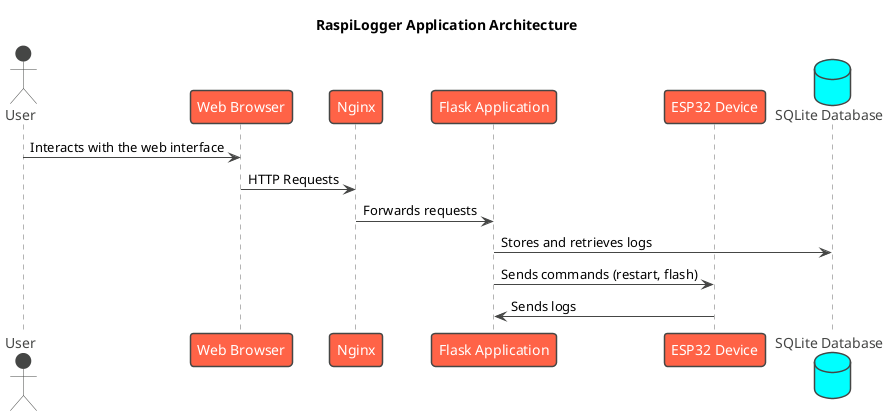

# RaspiLogger

RaspiLogger is a Flask-based web application for logging and monitoring ESP32 devices. It provides a web interface to view real-time logs, manage log data, and interact with the connected ESP32 device.

## Features

*   **Real-time Log Streaming**: View logs from your ESP32 device in real-time.
*   **Log Filtering**: Filter logs by tags to easily identify and analyze specific issues.
*   **Log Storage**: Logs are stored in a SQLite database for persistence.
*   **Device Management**: Restart and flash the connected ESP32 device from the web interface.
*   **Data Export**: Download logs in CSV format for further analysis.
*   **Systemd Service**: Run the application as a systemd service for automatic startup on boot.
*   **Nginx Integration**: Use Nginx as a reverse proxy for the Flask application.

## Installation

These instructions assume you are running a Debian-based Linux distribution (e.g., Raspberry Pi OS).

### 1. Clone the Repository

```bash
git clone <repository-url>
cd raspiLogger
```

### 2. Install Dependencies

The application requires Python 3, pip, and virtualenv.

```bash
sudo apt-get update
sudo apt-get install python3 python3-pip python3-venv stow
```

### 3. Create a Virtual Environment

```bash
python3 -m venv venv
source venv/bin/activate
```

### 4. Install Python Packages

```bash
pip install -r requirements.txt
```

## Configuration

### 1. Systemd Service

The `raspiLogger.service` file is provided to run the application as a systemd service. Before installing the service, you need to update the `User` and `WorkingDirectory` in the service file to match your setup.

**File:** `etc/systemd/system/raspiLogger.service`

```ini
[Unit]
Description=ESP32 Logger and Web UI Service
After=network.target

[Service]
# Replace 'wester' with your actual username if different
User=wester
# Replace with the full path to your project directory
WorkingDirectory=/home/wester/raspiLogger
# Replace with the full path to your venv's python and your main.py script
ExecStart=/home/wester/raspiLogger/venv/bin/python3 /home/wester/raspiLogger/app.py
Restart=always

[Install]
WantedBy=multi-user.target
```

Once you have updated the service file, you can install it using the provided script:

```bash
sudo ./scripts/install.sh
```

### 2. Nginx

The provided Nginx configuration file will set up a reverse proxy for the Flask application. The default server name is `raspilab.local`. You can change this in the configuration file.

**File:** `scripts/nginx/etc/nginx/sites-available/raspiLogger.nginx.conf`

```nginx
server {
    listen 80;
    server_name raspilab.local;
    client_max_body_size 2M;

    location / {
        proxy_pass http://127.0.0.1:5000; # Assuming Flask app runs on port 5000
        proxy_set_header Host $host;
        proxy_set_header X-Real-IP $remote_addr;
        proxy_set_header X-Forwarded-For $proxy_add_x_forwarded_for;
        proxy_set_header X-Forwarded-Proto $scheme;
    }
}
```

The `install.sh` script will also install and enable the Nginx configuration.

## Usage

### Running the Application

If you are not using the systemd service, you can run the application directly:

```bash
source venv/bin/activate
python app.py
```

The application will be available at `http://<your-raspberry-pi-ip>:5000`.

### Connecting to the Logger

To connect your ESP32 device to the Raspberry Pi, simply connect it via a USB cable. The application will automatically detect the device and start logging.

## Commands

*   **Start the service:** `sudo systemctl start raspiLogger.service`
*   **Stop the service:** `sudo systemctl stop raspiLogger.service`
*   **Restart the service:** `sudo systemctl restart raspiLogger.service`
*   **Check the status of the service:** `sudo systemctl status raspiLogger.service`
*   **View the application logs:** `journalctl -u raspiLogger.service`

## API Endpoints

*   `GET /`: Serves the main dashboard page.
*   `GET /tags`: Returns all unique tags from the database.
*   `GET /filtered_logs/<tag>`: Returns the last 10 log messages for a specific tag.
*   `POST /restart_device`: Restarts the connected ESP32 device.
*   `GET /boot_logs`: Returns the latest boot logs.
*   `GET /connection_status`: Returns the current ESP32 connection status.
*   `GET /stats`: Returns the current logging statistics.
*   `GET /latest_logs/<level>`: Returns the last 10 log messages for a specific level.
*   `GET /download/<level>`: Downloads logs in CSV format for a specific level.
*   `POST /reset`: Clears all logs and resets statistics in the database.
*   `POST /flash_device`: Flashes a binary to the ESP32 device.
*   `GET /all_logs/<level>`: Returns all log messages for a specific level.
*   `GET /app_logs`: Returns the content of the application log file.

## Architecture



## Project Structure

```
raspiLogger/
├── .gitignore
├── app.py              # Main Flask application
├── cmd.txt
├── database.py         # Database initialization and helper functions
├── device_detection.py # ESP32 device detection logic
├── esp_handler.py      # Handles communication with the ESP32
├── log_parser.py       # Parses log messages from the ESP32
├── requirements.txt    # Python dependencies
├── routes.py           # Flask routes
├── esptools/           # ESP tool scripts
├── etc/                # System configuration files
│   └── systemd/
│       └── system/
│           └── raspiLogger.service
├── scripts/            # Installation and helper scripts
│   ├── install.sh
│   ├── update_nginx_config.sh
│   └── nginx/
│       └── etc/
│           └── nginx/
│               └── sites-available/
│                   └── raspiLogger.nginx.conf
├── static/             # Static assets (JS, CSS)
│   └── js/
└── templates/          # HTML templates
    └── index.html
```

## Todo List

*   Certificate generation
*   Reset reason logging
*   GPIO integration/triggering
*   Binary compilation

## License

This project is licensed under the MIT License - see the [LICENSE](LICENSE) file for details.